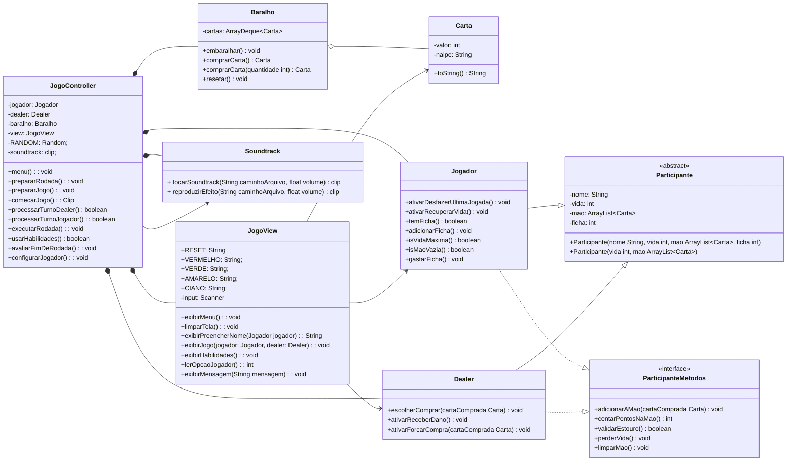

```mermaid
classDiagram
    direction LR

    class JogoView {
        +RESET: String
        +VERMELHO: String;
        +VERDE: String;
        +AMARELO: String;
        +CIANO: String;
        -input: Scanner
        +exibirMenu(): void
        +limparTela(): void
        +exibirPreencherNome(Jogador jogador): String
        +exibirJogo(jogador: Jogador, dealer: Dealer): void
        +exibirHabilidades(): void
        +lerOpcaoJogador(): int
        +exibirMensagem(String mensagem): void
    }

    class JogoController {
        -jogador: Jogador
        -dealer: Dealer
        -baralho: Baralho
        -view: JogoView
        -RANDOM: Random;
        -soundtrack: clip;
        +menu(): void
        +prepararRodada(): void
        +prepararJogo(): void
        +comecarJogo(): Clip
        +processarTurnoDealer() boolean
        +processarTurnoJogador(): boolean
        +executarRodada(): void
        +usarHabilidades() boolean
        +avaliarFimDeRodada(): void
        +configurarJogador(): void
    }

    class Baralho {
        -cartas: ArrayDeque~Carta~
        +embaralhar() void
        +comprarCarta() Carta
        +comprarCarta(quantidade int) Carta
        +resetar() void
    }

    class Carta {
        -valor: int
        -naipe: String
        +toString() String
    }

    class Jogador {
        +ativarDesfazerUltimaJogada() void
        +ativarRecuperarVida() void
        +temFicha() boolean
        +adicionarFicha() void
        +isVidaMaxima() boolean
        +isMaoVazia() boolean
        +gastarFicha() void
    }

    class Participante {
        <<abstract>>
        -nome: String
        -vida: int
        -mao: ArrayList~Carta~
        -ficha: int
        +Participante(nome String, vida int, mao ArrayList~Carta~, ficha int)
        +Participante(vida int, mao ArrayList~Carta~)
    }

    class ParticipanteMetodos {
        <<interface>>
        +adicionarAMao(cartaComprada Carta) void
        +contarPontosNaMao() int
        +validarEstouro() boolean
        +perderVida() void
        +limparMao() void
    }

    class Dealer {
        +escolherComprar(cartaComprada Carta) void
        +ativarReceberDano() void
        +ativarForcarCompra(cartaComprada Carta) void
    }
    
    class Soundtrack {
        + tocarSoundtrack(String caminhoArquivo, float volume) clip
        + reproduzirEfeito(String caminhoArquivo, float volume) clip
    }

    Baralho o-- Carta
    JogoController *-- Soundtrack
    JogoController *-- Baralho
    JogoController *-- Jogador
    JogoController *-- Dealer
    JogoController *-- JogoView
    JogoController --> Soundtrack
    Jogador --|> Participante
    Dealer --|> Participante
    Jogador ..|> ParticipanteMetodos
    Dealer ..|> ParticipanteMetodos
    JogoView --> Carta
    JogoView --> Jogador
    JogoView --> Dealer
```
